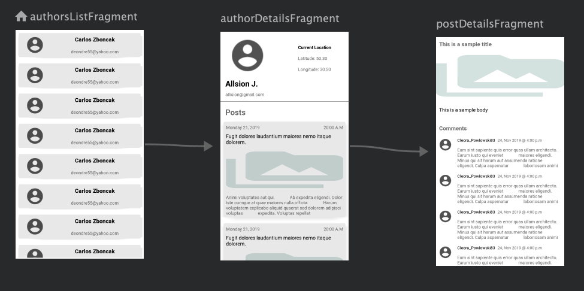

# Micro Blogging platform (MB)

# Android Studio IDE setup 

MicroBlog requires Android Studio version 3.4 or higher

# Concepts Used 
* Navigation 
* MVVM Architecture
* Dependency Injection
* Data Persistence
* Data Binding
* Repository Pattern 
* Separation of Concerns

MB uses the concept of single activity aided with navigation to interact among. Navigation handled each fragments 
transaction used in the app, starting from the default fragment (AuthorsFragment).

# User Interaction 

Each piece (fragment) depends on a repository that acts as a single source of truth for data provision. 
The repository feeds its data from two different sources (remote and local). For faster
access of data, the local source is accessed initially, the remote data is only accessed if the 
local source is empty and the success response is cached for future use. 

In situations where the user is interested in fresh / updated data, the remote data is accessed 
initially while the local data source is cleared to give way for the newly pulled data in the local store.

Separations of concerns concept is deeply used in MB, the views (activities & fragments) can only have 
access to data via the viewModel. One of the key functionality of the viewModel is to serve as a middleman 
between the views and the repository to access to the domain data. 

